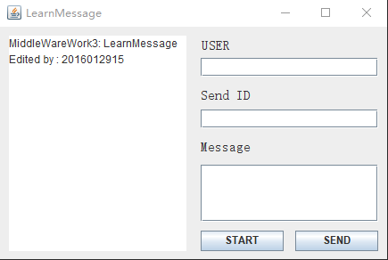

## 运行环境
- JDK配置正确
- ActiveMQ已经运行
## 使用方法
运行环境符合后，双击chat.jar即可自动运行

1. 先填写USER即用户名
2. 然后填写收信用户的用户名
3. 点击start创建用户的接收消息队列
4. 用户和收信用户都点击过start后，可以在message中编写消息
5. 点击SEND发送

## 注意
软件的执行逻辑是，当点击start后，创建一个和用户名相同的队列作为该用户的接收消息队列，其他用户发送给该用户的消息都会存储到该用户的同名消息队列中。

例如： 现有USER为Fang和Li的两个用户，当分别点击start后，会创建两个名为“Fang”“Li”的消息队列，当Fang发送消息给Li时，就会将消息添加到名为“Li”的消息队列中。

这样理论上可以实现多人同时聊天的功能。